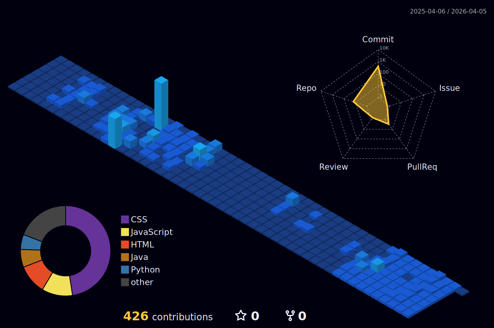

# Hi I'm Gustavo Navarro !

**Software Developer • Experience is the best teacher**

## 💻 **Junior Full Stack Developer** 💻

I'm **Gustavo Navarro**, Programming technician focused on software development, with knowledge of Java, Python, HTML, CSS, JavaScript, and data management using JSON. Notable for skills in teamwork, assertive communication, and conflict resolution. 

  ➡️ Receptive to new professional opportunities and collaborations

---

### 📬 Connect with me:

📧 **adolfonavarro0212@gmail.com** • 📱 **+57 3207092752**

> 📣 **You can contact me more easily via LinkedIn or Email.**

---

### 🧠 Skills

<table align="center">
  <tr>
    <td align="center" width="200"><b>🌐 Front-End</b></td>
    <td align="center">
      
      
      
    </td>
  </tr>
  <tr>
    <td align="center"><b>💻 Back-End / Logic</b></td>
    <td align="center">
      
      
    </td>
  </tr>
  <tr>
    <td align="center"><b>💾 Databases</b></td>
    <td align="center">
      
      
    </td>
  </tr>
  <tr>
    <td align="center"><b>🧠 Methodologies & VCS</b></td>
    <td align="center">
      
      
      
    </td>
  </tr>
  <tr>
    <td align="center"><b>🎨 Design</b></td>
    <td align="center">
      
    </td>
  </tr>
</table>

---

### 📊 GitHub Statistics

### 📈 3D Contribution Graph

